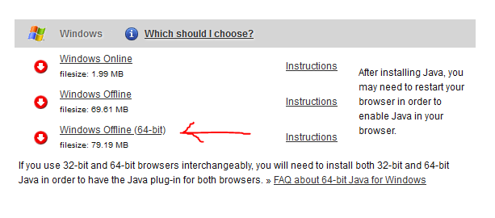
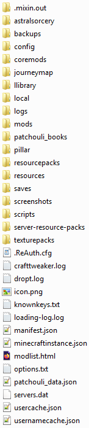
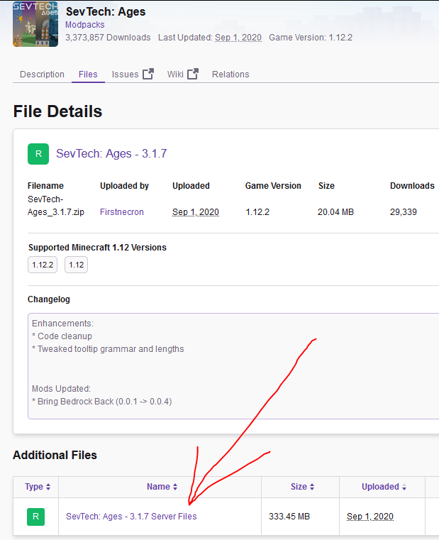
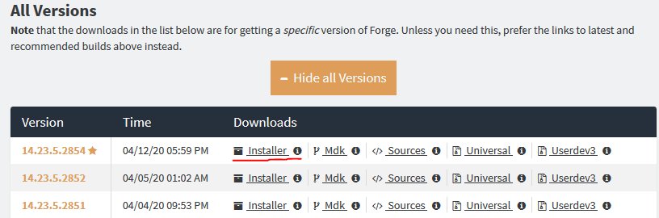
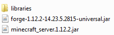

# Modded minecraft: a comprehensive guide
by ConfusedReptile#6830

## Introduction

This guide is made for people with little or none experience in modded Minecraft. However, it's not meant to be a simple step-by-step "what to do" guide (though it has that too!), but rather aims to provide a detailed understanding of how modded Minecraft works, which normally only comes from experience messing with it.

**Current status**: first public version.

The guide tries to be OS-agnostic, but was written by a Windows user and mostly involves Windows examples.

If anything in the guide is incorrect for other platforms, or just incorrect in general, please let me know!

Now, as this is a rather lofty goal, we must start far away - with...

## The Java Virtual Machine

Minecraft (the Java Edition, the first one, the kind that people generally think of when they say "Minecraft") is written in Java. There aren't many things you need to know about it as a modded Minecraft player, but here are some you should:

Java is a so-called "write once, run anywhere" language, meaning that programs written in Java don't need to have separate binaries for different operating systems. How is that achieved? Well, Java isn't a compiled language - instead of the code being made directly into executables like languages like C can, it is instead compiled into bytecode that is then executed by the Java Virtual Machine. As a result, all the effort of making sure the code works the same on all systems falls onto the shoulders of the people developing the JVM itself, while Java programmers don't need to think of it.

As a user, what that means for you is that to launch a Java program, you can't just launch it as an executable - you need to launch *the JVM*, and point it to the Java program in question.

The JVM also has an automatic *garbage collector* (GC) - it tracks objects that are no longer used anywhere and delets them to free memory. This process is generally not explicitly requested by the program - it's supposed to decide itself when and how to collect garbage to minimize time spent on it, and so maximize performance.

### JAR files

Java programs are usually shipped as files with a `.jar` extension, which are essentially glorified ZIP archives storing class (`.class`) files - and yes, that means something like 7zip can open up a `jar` file and let you change the contents. In fact, in the early days of Minecraft modding (before around, what, 1.2.5?), installing many mods involved unpacking them into the Minecraft client jar. Note that not all `.jar` files can necessarily be executed by themselves - libraries can be packaged into jars too.

### Launching JAR files

On many operating systems, you can launch a jar by double-clicking it if you have Java installed. What happens when you do that is that your operating systems launches the program this extension is associated with - the JVM executable for your system, usually called something like `java.exe` - and passes it the path to the jar as a parameter. The overall command might look like:

`java -jar "D:/Minecraft Servers/My Cool Modpack/forge-1.12.2-14.23.5.2838-universal.jar"`

Let's research this a bit, since console commands like this is how we'll be launching servers later.
- `java`, here, is the name of the Java executable. Note that the reason we can just call it like this, instead of providing the full path to it, like `"C:\Program Files\Java\jre1.8.0_241\bin\java.exe" -jar "D:/Minecraft Servers/My Cool Modpack/forge-1.12.2-14.23.5.2838-universal.jar"`, is because when Java is installed, it normally adds its `bin` folder to the `PATH` environment variable, the purpose of which is exactly this - it stores the directories in which to look in to resolve unknown console commands. So if your Java is installed right, the command line will understand that by `java`, you mean the aforementioned executable.
- `-jar <something>` is an argument, passed to the `java` executable. As one may guess, it is used to provide the path to a `jar` file to be launched. Here, we provide an *absolute* path - straight from the drive's root. Later we'll see an example with a *relative* path instead.

Now, if one wanted to know the full set of arguments the `java` executable accepts and what they do, one could look at [the documentation for it](https://docs.oracle.com/javase/8/docs/technotes/tools/windows/java.html). The overwhelming majority of them, however, are not important for modded minecraft. One subset that absolutely is, however, are **the memory allocation arguments**.

### Memory allocation

Allocating memory to the JVM is done by specifying two more options: `-XmX` and `-XmS`.
- `-XmX<something>` (for example, `-Xmx2048M` or `-Xmx4G`), as the documentation can tell us, "Specifies the maximum size of the memory allocation pool". This is the amount of memory that the JVM will generally try to never go above. Lack of this argument **is the reason why double-click-launching modded Minecraft servers will generally not work** - this launches them with the default memory limit, which is usually something like 512-2048 MB, way too low for most modded servers. So the server is simply starved of memory and either crashes during startup, or takes ages to start as the Garbage Collector desperately tries to make it fit.
- `-XmS<something>` (for example, `-Xms1024M` or `-Xms2G`). This "Sets the initial size of the heap". One reason this argument can be important is that sometimes the garbage collector may try to match *this* threshold rather than the maximal one, and harm performance as a result.

The right memory allocation numbers for a modded Minecraft server will be discussed a bit later in the corresponding section.


### Installing Java

For modded minecraft, you will generally need **Java 8 64-bit**, specifically. You can download it here: <https://www.java.com/en/download/manual.jsp>; make sure to grab the 64bit version:


- The reason you want Java 8 specifically is because that's about the only version Minecraft Forge (on most Minecraft versions) supports - not lower and not higher (even though vanilla Minecraft is more flexible). 
- The reason you want a 64-bit one is because a 32-bit one is inherently limited to a certain amount of memory, one that's generally not enough for most modern modpacks.

To check that you did it right, open the command line and do `java -version`. You should see something like:
```
java version "1.8.0_241"
Java(TM) SE Runtime Environment (build 1.8.0_241-b07)
Java HotSpot(TM) 64-Bit Server VM (build 25.241-b07, mixed mode)
```
Note the "1.**8**.0"(Java 8) and "64-Bit Server VM".

If you get something like "`java` is not a recognized command" instead, something went wrong and your Java installation is not in PATH.

## Minecraft mod loaders

### Minecraft Forge
[Minecraft Forge](https://files.minecraftforge.net/) (not to be confused with [Curseforge](https://www.curseforge.com/), a popular mod and modpack hosting site)(nor with SpongeForge, a plugin manager for MinecraftForge) and ForgeModLoader(FML) are (as of September 2020) the most popular Minecraft modding API and mod loader. The creation of MCForge dates back to the early days of Minecraft modding (around Minecraft Beta). If you don't know what modloader a modpack is using, it's probably FML.

(For a nicer and more detailed description of early modding history, see [A Brief History of Minecraft Modding](https://hub.packtpub.com/brief-history-minecraft-modding/).)

### Fabric

[Fabric](https://fabricmc.net/) is a new (introduced in ~2018?) mod loader, and a modding API for Minecraft 1.14 and above. It is lightweight, but aims to provide a similar set of features to Forge. While it is still not as popular as Forge (and is unlikely to replace it for versions earlier than 1.14), its popularity among modders has grown very quickly. As of this writing, very few of the "big" mods have Fabric ports, so the modding scene is somewhat different and less impressive than the Forge one, but this may change in the future. For now though, most modpacks you find, and those made by teams like FTB, are going to be Forge modpacks.

TODO: do some research and write more details, and maybe provide a link to a good explanation *why* many modders have migrated to Fabric so eagerly.

## Installing Forge

I'll skip the process of manually installing Minecraft Forge on a vanilla client, simply because I don't really see a reason to ever do so nowadays. Use a modded launcher instead.

## Using Modded Launchers

A modded launcher is a program that helps with managing and launching modpacks. Generally speaking, a modded launcher can do one or more of the following:
- store many modpacks as separate *instances*, allowing modification of any of them without affecting the others
- create a new vanilla instance and install Forge or Fabric into it with just a few clicks
- automatically download and install modpacks from sites like [Curseforge](https://www.curseforge.com/) from just a link or a manifest file
- simplify the process of editing modpacks in some way, from simply being able to open the `mods` folder of a specific instance to being able to install a mod by just selecting it on Curseforge

Before installing a launcher: 

I personally recommend [MultiMC](https://multimc.org/) as a general-purpose launcher - it is lightweight, reliable and can do all of the above. The only disadvantage it has is that it doesn't have an inbuilt *browser* of Curseforge modpacks - you need to find a modpack you want to play on Curseforge, download the modpack manifest file (essentially a small `.zip` archive containing the custom scripts/recipes for the pack, but not the mods - only a file specifying what mods and of what versions must be installed), and import it as a new instance (or just drag-and-drop it into MultiMC). The launcher will handle the rest.

In case you *do* really want to be able to install Curseforge modpacks and mods from the launcher itself, then you probably want [GDLauncher](https://gdevs.io/) or the [Twitch Launcher](https://help.twitch.tv/s/article/How-to-Play-Minecraft-with-Twitch-App). The latter is very popular (the most popular modded minecraft launcher, maybe?), but notoriously has some problems (like certain modpacks randomly refusing to be installed for *days*) that can't be solved by the users.

The [FTB Launcher](https://www.feed-the-beast.com/) (more specifically, the new FTBApp) is a launcher from the Feed The Beast modpack development team. FTB modpacks are not stored on Curseforge, which is what necessitates such a launcher. It only provides access to (the many) FTB modpacks (and some third-party ones), and can't install Curseforge ones. Note, however, that the newest versions of MultiMC have the ability to install FTB packs too.

## Anatomy of a Modpack

An installed (into a MultiMC instance in my case) Forge modpack usually looks something like this:



That's a lot of folders and files there! Don't worry, though, only some of them you want to know about:
- the `mods` folder, present in any Forge modpack, stores the mods of the modpack. Specifically, when the modpack is launched, the FML loads every `.jar` file in `mods` as a mod. This tells you how to **disable a mod**, by the way - it's enough to either take it out of the folder or change its extension. For example, MultiMC disables mods by changing their extensions from `.jar` to `.jar.disabled` (which naturally don't count as `.jar` files and are ignored by the FML).
- the `saves` folder, present in any Minecraft instance, stores the saves - a folder per world. This is the main thing you want to backup or transfer between instances
- the `backup` folder is created by a backup mod like AromaBackup or FTBBackups. In it, automatically or manually generated backups are stored. See the documentation for these mods for details, but you *probably* want to configure the automatic backups right away, regardless of what pack you're playing.
- the `configs` folder, present in any Forge modpack, stores the configuration files for the mods in it. The configuration files can be called and structured however the mods desire, but most often it's either a single `.cfg` file or a subfolder called the same as the mod. 
- the `scripts` folder, present in any modpack with ModTweaker/CraftTweaker, stores the tweaker scripts. These are how custom recipes are implemented. The scripts, along with the configs, **are what make modpacks more than just collections of mods**. Two modpacks with the same mods can be extremely different depending on the custom recipes and configs. If you want examples, check out hardcore survival modpacks like Crash Landing or skyblock ones like Agrarian Skies.
- the `logs` folder stores logs. If your modpack crashes, these will generally be helpful.
- the `crash-reports` folder stores crash reports - it gets created with the first such report. Unlike the full log, it contains only the information directly relevant to the crash. If you're requesting support about your modpack crashing, provide both if possible.
- the `options.txt` files stores the clientside options - from music volume to Controls configuration. I generally transfer this file too when migrating my saves to a new instance (say, to a new version of the same modpack), so that I don't have to configure all the things again.

## Running Forge servers
In order to run a Forge server, one must:

#### 0) Have Java installed.
See [Installing Java](#installing-java).

#### 1) Get the modpack files.

The server files generally look about like the client files (see [Anatomy of a Modpack](#anatomy-of-a-modpack)), and in fact may be identical in some cases - some mods are only useful clientside or serverside, but it's possible for a mod to recognize whether it's on a client or a server, so most mods will just do nothing when launched on the wrong side.

If your modpack is on Curseforge, the server files are generally available there too, as just `.zip` files to unpack in a location of your choice. Here's how it may look:


FTB modpacks allow downloading the modpack files from the FTBApp or from the site. They, however, are shipped not as zip-archives, but as executables - `.exe` for Windows, extensionless for Linux. The user is supposed to put them into a folder where they want the modpack to be installed, launch it, and if everything goes right, the installation process will be handled for them.

#### 2) Get Minecraft Forge.

Curseforge modpacks may or may not contain Minecraft Forge already installed - a file called something like `forge-1.12.2-14.23.5.2838-universal.jar` and a `libraries` folder (usually not present in client instances).

FTB server file installers (see 1)) always install Forge along with the modpack.

#### Manually installing Forge for servers

If Forge does *not* come with the files (pretty common, as shipping Forge with the files deprives the Forge developers of advertisement income), you'll have to do so manually. For that:
- Find out what Forge version the client version of the modpack uses. In MultiMC, you can see that in Edit Instance; other launchers likely also have that ability. If you really can't find out for some reason, assume it's the latest one (usually not just the latest *recommended* one) for that Minecraft version.
- Download that Forge version from [the site](https://files.minecraftforge.net/). You want the *installer*. For example, the latest 1.12.2 version:


- Run the installer, choose Install Server, and point it to the folder you unpacked the server files to.
- After the installation, you should end up with the following additional files and folders:


where the jars will be called accordingly depending on the Minecraft and Forge versions.

#### 3) Run the Forge jar

Firstly, *do not ever run the `minecraft_server.<version>.jar` jar*. This will launch a vanilla minecraft server. Not only is this not what you want, but it will generate a vanilla world, which you'll need to then delete unless you want to later wonder why is it that you have absolutely no modded ores or any other kind of worldgen close to the world's spawnpoint.

Secondly, as we've learned in [Launching JAR files](#launching-jar-files), double-clicking jars to launch them is not a good idea. Manually writing the command in command line works, but is rather annoying. What you need is a *launch script* - a batch (for Windows) or bash script that simply launches the server with the right arguments.

If Forge was installed for you when you downloaded the files, a launchscript probably was too - traditionally called `ServerStart.bat` (`.sh` for Linux) or `start.bat` something like that. In this case it will likely be enough to simply double-click it to launch the server. However, we'll go through the (rather simple) process of creating a custom launch-script anyway.

#### Creating a basic launch script

Recall that the command we want is something like:

`java -Xmx4G -Xms4G -jar "D:/Minecraft Servers/My Cool Modpack/forge-1.12.2-14.23.5.2838-universal.jar"`
This will set both initial and total memory allocation to 4 gigabytes, and launch a jar with a certain name located at a certain path.

However, since we will place the launch-script in the same folder as the jar in question, we don't need an absolute path - a relative one will be far simpler: just `forge-1.12.2-14.23.5.2838-universal.jar`.
Also, we might want to supply the `-server` option to "select the Java HotSpot Server VM", which generally has better performance in exchange for starting longer. Note that this won't work on a 32bit Java.
In addition, we add `nogui` to disable the vanilla server GUI, routing the server's console output to the console window instead.
Now, after the server process ends, the window will immediately close. This can be annoying if, say, the server crashes and you want to see the logs right before the crash. To prevent that, we add another command, `pause`, which simply waits for any input.

And so we obtain **an extremely basic launch-script**:
```bash
java -server -Xmx4G -Xms4G -jar forge-1.12.2-14.23.5.2838-universal.jar nogui
pause
```

We can copy this into Notepad, save with a `.bat` extension, like `MyStart.bat`, and place it into the server's folder. We'll now be able to launch the server by double-clicking it. You can add a shortcut of the script to your desktop for convenience.

### But how much memory do I need?

Good question! This highly depends on both the Minecraft version and the amount of mods you run.

For modern modpacks, the lighter ones are fine at around 4G allocated memory, and even the heaviest rarely take more than 8G.

Older modpacks (1.7.10 and even more so 1.6.4) are a lot less hungry - even the heavy ones from that time are fine on 4G, and many take only 2G.

Generally, however, you *just start with a low guess and increase if the server shows signs of memory shortage* - the most obvious such sign is severe serverside freezes at regular intervals (as the garbage collector works overtime to fit into the memory limits).

### What about the garbage collection parameters?

Another good question, this one hard. The script above is a *basic* one. If you look at a script shipped with, say, an FTB pack, you'll likely see a lot of extra options like:
```bash
-XX:+UseParNewGC -XX:+CMSIncrementalPacing -XX:+CMSClassUnloadingEnabled -XX:ParallelGCThreads=5 -XX:MinHeapFreeRatio=5 -XX:MaxHeapFreeRatio=10
```
What these do is tune the garbage collector for, hopefully, better performance than the default. The problem is that "how do I tune the GC for optimal performance" is quite literally something there are books written on, so it's way outside the scope of this guide (and my competence). I can only point to this amazing post, which also describes how the performance and memory usage of modded Minecraft changed over time:
[Modded MC and memory usage, a history with a crappy graph](https://www.reddit.com/r/feedthebeast/comments/5jhuk9/modded_mc_and_memory_usage_a_history_with_a/).

Note, however, that the post in question is 3 years old and may be outdated. I do not, however, know a more modern guide on this.